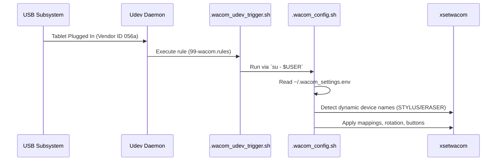

# 🏗️ Architecture

This document provides a high-level overview of how the Open Graphic Tablet Configurator components interact to provide seamless, dynamic device configuration.

## System Overview

The system is composed of two main pillars:
1. **The Core Scripts (Bash/System):** Responsible for hardware detection, configuration application, and OS-level integration.
2. **The Dashboard (Electron/React):** A GUI that provides an intuitive interface for users to update configurations.

Both pillars communicate via a shared configuration file (`~/.wacom_settings.env`).

## 🔄 The Hotplug Flow

The core feature of this tool is its ability to instantly configure any Wacom tablet upon connection. This is achieved through the following flow:



### Component Details

1. **`99-wacom.rules`**: Installed in `/etc/udev/rules.d/`. Monitors the USB subsystem for Vendor ID `056a` (Wacom).
2. **`.wacom_udev_trigger.sh`**: Udev runs as root. This script identifies the active X11 user, exports necessary display variables (`DISPLAY`, `XAUTHORITY`), and drops privileges to execute the configuration script.
3. **`.wacom_config.sh`**: The brain of the operation. It polls `xsetwacom` to find exactly what devices (stylus, eraser, pad) are connected, reads the user preferences, and applies them dynamically.

## 🖥️ Dashboard Architecture

The Electron dashboard provides a modern UI for editing `~/.wacom_settings.env`.

```mermaid
graph TD
    UI[React Components] -->|Zustand State| Store[State Store]
    Store -->|IPC Actions| Preload[Preload Script]
    Preload -->|IPC Main| Main[Electron Main Process]
    Main -->|File I/O| FS[~/.wacom_settings.env]
    Main -->|Exec| X11[xsetwacom (Real-time updates)]
```

### IPC Communication
- The **Renderer** process (React) is completely isolated and has no node integration.
- It communicates via a context bridge (`window.api`) defined in the **Preload** script.
- The **Main** process handles file system reads/writes to the `.env` file and executes shell commands to apply settings in real-time without requiring a replug.

## ⌨️ Shortcut Handling

Shortcut handling integrates directly with Desktop Environment hotkey daemons (e.g., `xfconf` in XFCE or `rc.xml` in Openbox).

When a shortcut (like F10 on the stylus) is pressed, it executes `.wacom_button_logic.sh`.
This script uses a time-window algorithm to detect single taps, double taps, triple taps, or long presses, effectively multiplying the utility of limited stylus buttons.
